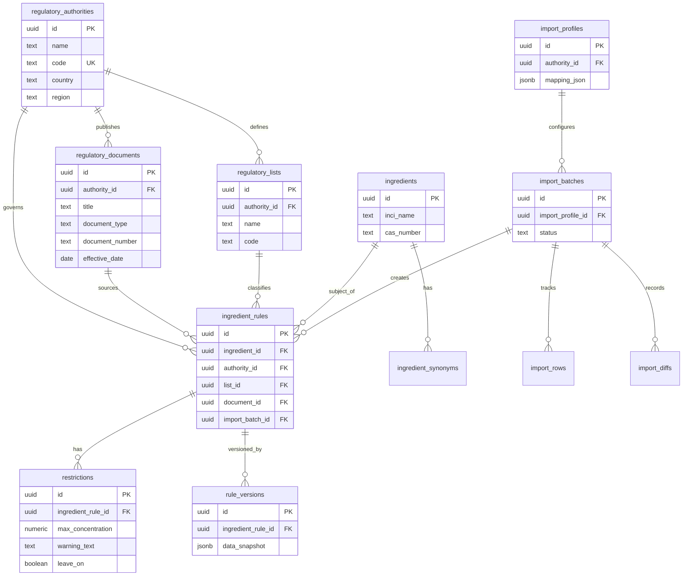

# Cosing AR — Brief de Arquitectura

**Versión:** 2.0  
**Fecha:** 26 de junio de 2026  
**Estado:** Modelo de dominio revisado — pendiente de confirmación antes de implementar Etapa 0  
**Audiencia:** Arquitecto de software / ChatGPT (revisión y validación)

> **Cambio v2.0:** Revisión de dominio. Se reemplazan entidades ambiguas (`Entry`, `Jurisdiction`, `imports`) por un modelo semántico orientado a organismos regulatorios, documentos normativos y reglas de ingredientes. Ver §4 y `docs/domain/`.

---

## 1. Resumen ejecutivo

**Cosing AR** es una plataforma SaaS regulatoria para la industria cosmética. Permite consultar ingredientes, restricciones y normativas de distintos organismos (ANMAT, MERCOSUR, UE, FDA, ANVISA, etc.).

No es una página web ni un buscador simple: es una **plataforma de referencia** para laboratorios, formuladores y equipos regulatorios.

### Decisión estratégica clave

Se abandonó por completo el prototipo anterior en **Laravel + MySQL + PHP**. Ese código queda en `cosing-ar/` como **legacy/reference** — no se reutiliza.

El producto nuevo se construye desde cero con:

| Capa | Tecnología |
|------|------------|
| Frontend / App | Next.js 15 (App Router), React 19, TypeScript |
| UI | Tailwind CSS 4, shadcn/ui, dark mode |
| Backend / DB | Supabase (PostgreSQL + Auth + RLS) |
| Deploy | Vercel |
| ORM | **No Prisma por ahora** — SQL nativo vía Supabase migrations |

**Repo nuevo:** `cosing-ar-next/`  
**Proyecto Supabase:** `cosing-ar` (crear desde cero)

---

## 2. Filosofía del producto

1. **La plataforma NO depende de Excel.** Excel/CSV son documentos fuente; la verdad está en PostgreSQL normalizado.
2. **Nunca diseñar el modelo alrededor de un Excel** — diseñar alrededor de la información regulatoria.
3. **Toda regla debe trazarse a un documento normativo** — resolución, anexo, adenda, boletín oficial.
4. **Escalable desde el día 1** — debe soportar cientos de miles de registros sin cambiar arquitectura.
5. **Modular y desacoplado** — cada módulo evoluciona independiente.
6. **Versionado obligatorio** — nunca borrar información regulatoria; toda actualización genera versión.
7. **Metodología iterativa** — etapas completas y desplegables; no features a medias.

### Referentes de UX

- Funcional: CosIng (UE)
- Estética: Linear, Stripe Dashboard, Supabase Dashboard, Vercel Dashboard

---

## 3. Glosario de entidades (nomenclatura oficial)

| Nombre anterior / ambiguo | Nombre oficial | Tabla PostgreSQL |
|---------------------------|----------------|------------------|
| Jurisdiction | **RegulatoryAuthority** | `regulatory_authorities` |
| Entry | **IngredientRule** | `ingredient_rules` |
| EntryVersion | **RuleVersion** | `rule_versions` |
| Import / imports | **ImportBatch** | `import_batches` |
| List / lists | **RegulatoryList** | `regulatory_lists` |
| — (nuevo) | **RegulatoryDocument** | `regulatory_documents` |
| — (nuevo) | **ImportProfile** | `import_profiles` |
| — (futuro) | **KnowledgeLayer** | capa lógica, no tabla única |

Documentación detallada por entidad: **`docs/domain/`**

---

## 4. Modelo de dominio (visión completa)

### Jerarquía conceptual

```
RegulatoryAuthority          → Organismo / marco regulatorio (ANMAT, MERCOSUR, UE, FDA…)
  ├── RegulatoryDocument     → Resolución, anexo, adenda, PDF oficial, boletín
  ├── RegulatoryList         → Anexo temático (Conservantes, Colorantes, Prohibidos…)
  └── IngredientRule         → Regla regulatoria aplicada a un ingrediente
          ├── Ingredient     → Dato maestro de la sustancia
          ├── Restriction    → Condiciones concretas de uso (concentración, advertencias…)
          ├── RuleVersion    → Snapshot inmutable ante cada cambio
          └── (trazabilidad ImportBatch)

Ingredient
  ├── IngredientSynonym
  └── IngredientRule[]

ImportBatch                  → Lote de carga con historial completo
  ├── ImportProfile          → Configuración de mapeo (no hardcode)
  ├── ImportRow              → Trazabilidad fila a fila
  └── ImportDiff             → Diff antes/después por registro
```

### Relación central (regla de oro)

```
Ingredient  →  IngredientRule  →  Restriction
```

- Un **Ingredient** es maestro: INCI, CAS, sinónimos, función. **No contiene restricciones.**
- Un **IngredientRule** es la aparición regulatoria: ingrediente + lista + autoridad + documento normativo.
- Una **Restriction** es una condición concreta de esa regla (puede haber N por regla).
- **La misma sustancia puede tener múltiples IngredientRules** en distintas listas, documentos o condiciones.

### Diagrama ER conceptual (Etapa 1+)



### Etapa 0 — tablas mínimas (nombres correctos desde el inicio)

| Tabla | Etapa |
|-------|-------|
| `profiles` | 0 |
| `regulatory_authorities` | 0 |
| `regulatory_documents` | 0 |
| `regulatory_lists` | 0 |
| `ingredients` | 0 |
| `ingredient_synonyms` | 1 |
| `ingredient_rules` | 1 |
| `restrictions` | 1 |
| `rule_versions` | 1 |
| `import_profiles` | 2 |
| `import_batches` | 2 |
| `import_rows` | 2 |
| `import_diffs` | 2 |

### Etapa 0 — explícitamente NO crea

- `ingredient_rules`, `restrictions`, `rule_versions`
- `import_batches`, `import_profiles`, `import_rows`, `import_diffs`

El modelo futuro queda documentado en `docs/domain/` para validación antes de Etapa 1.

---

## 5. Knowledge Layer (decisión arquitectónica — no implementar aún)

Capa futura de conocimiento regulatorio que permitirá responder:

- ¿Qué cambió entre versiones normativas?
- ¿Qué documentos afectan a un ingrediente?
- ¿Qué restricciones aplican a un producto leave-on?
- ¿Qué ingredientes tienen advertencias obligatorias?
- ¿Qué reglas se originan en determinada resolución?

**No es una feature de Etapa 0.** Es una decisión de diseño: el modelo actual (`IngredientRule` + `Restriction` + `RegulatoryDocument` + `RuleVersion`) debe soportar estas consultas sin reestructuración.

Ver: `docs/domain/KnowledgeLayer.md`

---

## 6. Arquitectura de módulos

```
src/modules/
├── core/              # Authority, Document, List, Ingredient, IngredientRule, Restriction
├── imports/           # ImportProfile, ImportBatch, parser, validator, rollback
├── search/            # FTS, filtros, comparador (Etapa 3+)
├── admin/             # Usuarios, roles, abreviaturas, logs
├── subscriptions/     # Planes, pagos (Etapa 5+)
├── api/               # Endpoints públicos/privados (Etapa 6+)
└── knowledge/         # Knowledge Layer / IA (Etapa 6+)
```

**Principio:** `src/app/` solo orquesta UI y rutas. Toda lógica de dominio vive en `src/modules/`.

---

## 7. Estructura de carpetas — Etapa 0

```
cosing-ar-next/
├── docs/
│   ├── ARCHITECT-HANDOFF.md          # Este documento (v2.0)
│   ├── MASTER_PROMPT.md              # Visión del producto
│   ├── DATA_SOURCES.md               # CSV normalizado (Etapa 1)
│   ├── DEPLOY.md                     # Vercel + Supabase
│   └── domain/                       # Documentación de dominio ★ NUEVO
│       ├── README.md                 # Índice del modelo
│       ├── RegulatoryAuthority.md
│       ├── RegulatoryDocument.md
│       ├── RegulatoryList.md
│       ├── Ingredient.md
│       ├── IngredientRule.md
│       ├── Restriction.md
│       ├── ImportProfile.md
│       └── KnowledgeLayer.md
│
├── supabase/
│   ├── config.toml
│   ├── migrations/
│   │   └── 20250626100000_initial_schema.sql   # v2 — nombres correctos
│   └── seed.sql
│
├── src/
│   ├── app/
│   │   ├── layout.tsx
│   │   ├── globals.css
│   │   ├── page.tsx                              # Landing /
│   │   ├── (auth)/
│   │   │   ├── layout.tsx
│   │   │   ├── login/page.tsx
│   │   │   ├── register/page.tsx
│   │   │   └── auth/callback/route.ts
│   │   └── (app)/
│   │       ├── layout.tsx                        # Dashboard + sidebar
│   │       └── dashboard/page.tsx
│   │
│   ├── components/
│   │   ├── ui/                                   # shadcn/ui
│   │   └── layout/
│   │
│   ├── lib/supabase/
│   │   ├── client.ts
│   │   ├── server.ts
│   │   └── middleware.ts
│   │
│   ├── modules/
│   │   ├── core/
│   │   │   └── README.md                         # Placeholder — Etapa 1+
│   │   └── imports/
│   │       └── README.md                         # Placeholder — Etapa 2+
│   │
│   ├── types/
│   │   └── database.types.ts
│   │
│   └── middleware.ts
│
├── .env.example
└── (config Next.js, Tailwind, shadcn…)
```

---

## 8. Variables de entorno

Sin cambios respecto a v1.0:

```bash
NEXT_PUBLIC_APP_URL=http://localhost:3000
NEXT_PUBLIC_SUPABASE_URL=https://xxxxxxxx.supabase.co
NEXT_PUBLIC_SUPABASE_ANON_KEY=eyJ...
SUPABASE_SERVICE_ROLE_KEY=eyJ...   # Solo servidor
```

---

## 9. Migración SQL Etapa 0 (v2)

Archivo: `supabase/migrations/20250626100000_initial_schema.sql`

```sql
-- ─────────────────────────────────────────────────────────
-- Cosing AR — Schema inicial Etapa 0 (v2)
-- Tablas: profiles, regulatory_authorities, regulatory_documents,
--         regulatory_lists, ingredients
-- ─────────────────────────────────────────────────────────

CREATE EXTENSION IF NOT EXISTS "pgcrypto";

-- ─── Perfiles ───────────────────────────────────────────
CREATE TABLE public.profiles (
  id          UUID PRIMARY KEY REFERENCES auth.users(id) ON DELETE CASCADE,
  full_name   TEXT,
  avatar_url  TEXT,
  created_at  TIMESTAMPTZ NOT NULL DEFAULT now(),
  updated_at  TIMESTAMPTZ NOT NULL DEFAULT now()
);

CREATE OR REPLACE FUNCTION public.handle_new_user()
RETURNS TRIGGER LANGUAGE plpgsql SECURITY DEFINER SET search_path = public AS $$
BEGIN
  INSERT INTO public.profiles (id, full_name)
  VALUES (NEW.id, NEW.raw_user_meta_data ->> 'full_name');
  RETURN NEW;
END;
$$;

CREATE TRIGGER on_auth_user_created
  AFTER INSERT ON auth.users
  FOR EACH ROW EXECUTE FUNCTION public.handle_new_user();

-- ─── Autoridades regulatorias ───────────────────────────
CREATE TABLE public.regulatory_authorities (
  id           UUID PRIMARY KEY DEFAULT gen_random_uuid(),
  name         TEXT NOT NULL,
  code         TEXT NOT NULL UNIQUE,     -- ANMAT, MERCOSUR, EU, FDA, ANVISA
  country      TEXT,                       -- AR, BR, EU (multi-país), US
  region       TEXT,                       -- MERCOSUR, LATAM, EUROPE, GLOBAL
  description  TEXT,
  website_url  TEXT,
  is_active    BOOLEAN NOT NULL DEFAULT true,
  created_at   TIMESTAMPTZ NOT NULL DEFAULT now(),
  updated_at   TIMESTAMPTZ NOT NULL DEFAULT now()
);

CREATE INDEX idx_regulatory_authorities_code
  ON public.regulatory_authorities (code);
CREATE INDEX idx_regulatory_authorities_active
  ON public.regulatory_authorities (is_active) WHERE is_active = true;

-- ─── Documentos normativos ──────────────────────────────
CREATE TABLE public.regulatory_documents (
  id                UUID PRIMARY KEY DEFAULT gen_random_uuid(),
  authority_id      UUID NOT NULL REFERENCES public.regulatory_authorities(id) ON DELETE RESTRICT,
  title             TEXT NOT NULL,
  document_type     TEXT NOT NULL,       -- resolution, annex, addendum, official_pdf, gazette
  document_number   TEXT,                -- ej. "Res. GMC 03/2020"
  publication_date  DATE,
  effective_date    DATE,
  source_url        TEXT,
  file_path         TEXT,                -- Supabase Storage path (Etapa 2+)
  language          TEXT DEFAULT 'es',
  summary           TEXT,
  status            TEXT NOT NULL DEFAULT 'active',  -- draft, active, superseded, archived
  created_at        TIMESTAMPTZ NOT NULL DEFAULT now(),
  updated_at        TIMESTAMPTZ NOT NULL DEFAULT now(),

  CONSTRAINT regulatory_documents_status_check
    CHECK (status IN ('draft', 'active', 'superseded', 'archived'))
);

CREATE INDEX idx_regulatory_documents_authority
  ON public.regulatory_documents (authority_id);
CREATE INDEX idx_regulatory_documents_type
  ON public.regulatory_documents (document_type);
CREATE INDEX idx_regulatory_documents_status
  ON public.regulatory_documents (status);

-- ─── Listas regulatorias ────────────────────────────────
CREATE TABLE public.regulatory_lists (
  id            UUID PRIMARY KEY DEFAULT gen_random_uuid(),
  authority_id  UUID NOT NULL REFERENCES public.regulatory_authorities(id) ON DELETE RESTRICT,
  name          TEXT NOT NULL,           -- Conservantes, Colorantes, Prohibidos…
  code          TEXT NOT NULL,           -- CONSERVANTES, COLORANTES, PROHIBIDOS
  description   TEXT,
  is_active     BOOLEAN NOT NULL DEFAULT true,
  created_at    TIMESTAMPTZ NOT NULL DEFAULT now(),
  updated_at    TIMESTAMPTZ NOT NULL DEFAULT now(),

  CONSTRAINT regulatory_lists_authority_code_unique
    UNIQUE (authority_id, code)
);

CREATE INDEX idx_regulatory_lists_authority
  ON public.regulatory_lists (authority_id);

-- ─── Ingredientes (maestro) ─────────────────────────────
CREATE TABLE public.ingredients (
  id             UUID PRIMARY KEY DEFAULT gen_random_uuid(),
  inci_name      TEXT NOT NULL,
  chemical_name  TEXT,
  cas_number     TEXT,
  einecs         TEXT,
  function       TEXT,
  notes          TEXT,
  is_active      BOOLEAN NOT NULL DEFAULT true,
  created_at     TIMESTAMPTZ NOT NULL DEFAULT now(),
  updated_at     TIMESTAMPTZ NOT NULL DEFAULT now()
);

CREATE INDEX idx_ingredients_inci_name ON public.ingredients (inci_name);
CREATE INDEX idx_ingredients_cas_number ON public.ingredients (cas_number)
  WHERE cas_number IS NOT NULL;

-- ─── updated_at automático ──────────────────────────────
CREATE OR REPLACE FUNCTION public.set_updated_at()
RETURNS TRIGGER LANGUAGE plpgsql AS $$
BEGIN NEW.updated_at = now(); RETURN NEW; END;
$$;

CREATE TRIGGER regulatory_authorities_updated_at
  BEFORE UPDATE ON public.regulatory_authorities
  FOR EACH ROW EXECUTE FUNCTION public.set_updated_at();
CREATE TRIGGER regulatory_documents_updated_at
  BEFORE UPDATE ON public.regulatory_documents
  FOR EACH ROW EXECUTE FUNCTION public.set_updated_at();
CREATE TRIGGER regulatory_lists_updated_at
  BEFORE UPDATE ON public.regulatory_lists
  FOR EACH ROW EXECUTE FUNCTION public.set_updated_at();
CREATE TRIGGER ingredients_updated_at
  BEFORE UPDATE ON public.ingredients
  FOR EACH ROW EXECUTE FUNCTION public.set_updated_at();
CREATE TRIGGER profiles_updated_at
  BEFORE UPDATE ON public.profiles
  FOR EACH ROW EXECUTE FUNCTION public.set_updated_at();

-- ─── Row Level Security ───────────────────────────────────
ALTER TABLE public.profiles ENABLE ROW LEVEL SECURITY;
ALTER TABLE public.regulatory_authorities ENABLE ROW LEVEL SECURITY;
ALTER TABLE public.regulatory_documents ENABLE ROW LEVEL SECURITY;
ALTER TABLE public.regulatory_lists ENABLE ROW LEVEL SECURITY;
ALTER TABLE public.ingredients ENABLE ROW LEVEL SECURITY;

CREATE POLICY "profiles_select_own"
  ON public.profiles FOR SELECT USING (auth.uid() = id);
CREATE POLICY "profiles_update_own"
  ON public.profiles FOR UPDATE USING (auth.uid() = id);

CREATE POLICY "authorities_select_authenticated"
  ON public.regulatory_authorities FOR SELECT TO authenticated USING (true);
CREATE POLICY "documents_select_authenticated"
  ON public.regulatory_documents FOR SELECT TO authenticated USING (true);
CREATE POLICY "lists_select_authenticated"
  ON public.regulatory_lists FOR SELECT TO authenticated USING (true);
CREATE POLICY "ingredients_select_authenticated"
  ON public.ingredients FOR SELECT TO authenticated USING (true);
```

### Notas SQL v2

- `regulatory_documents` en Etapa 0 permite registrar normas antes de tener reglas importadas
- `document_type` y `status` son TEXT con CHECK — extensible sin migraciones por cada tipo nuevo
- `file_path` reservado para Supabase Storage (Etapa 2+)
- FTS (`search_vector`) → Etapa 3
- Tablas de reglas e importación → Etapa 1 y 2 (ver `docs/domain/`)

---

## 10. Flujo de autenticación

Sin cambios respecto a v1.0. Patrón `@supabase/ssr` con cookies HTTP-only.

| Ruta pública | `/`, `/login`, `/register`, `/auth/callback` |
| Ruta privada | `/app/dashboard`, `/app/*` |
| Auth Etapa 0 | Email + password. Sin OAuth. Sin roles avanzados. |

---

## 11. Roadmap por etapas (actualizado)

| Etapa | Scope | Entregable |
|-------|-------|------------|
| **0** | Fundación: Next.js, shadcn, Supabase Auth, layout, SQL v2 (authorities, documents, lists, ingredients) | App autenticada desplegable |
| **1** | Core regulatorio: `ingredient_rules`, `restrictions`, `rule_versions`, `ingredient_synonyms`, seed CSV | Modelo validado y poblado |
| **2** | Importador: `import_profiles`, `import_batches`, preview, commit transaccional, rollback | Nueva normativa sin tocar código |
| **3** | Buscador: PostgreSQL FTS sobre ingredients + rules + restrictions | Corazón del producto |
| **4** | Admin: roles RLS, abreviaturas, gestión documentos | Operación interna |
| **5** | Suscripciones: Stripe, planes | Modelo SaaS |
| **6+** | Knowledge Layer, comparador, alertas, API, IA | Visión largo plazo |

---

## 12. Decisiones modificadas (v1.0 → v2.0)

| # | Decisión anterior | Decisión nueva | Motivo |
|---|-------------------|----------------|--------|
| 1 | Entidad `Entry` | **`IngredientRule`** | "Entry" es ambiguo; la regla es el concepto regulatorio central |
| 2 | Entidad `Jurisdiction` | **`RegulatoryAuthority`** | Modelamos organismos/marcos, no solo países |
| 3 | Sin entidad documento | **`RegulatoryDocument`** | Toda regla debe trazarse a una norma/resolución/anexo |
| 4 | `Restriction` simple | **`Restriction` enriquecida** | Condiciones complejas: leave-on, nano, aerosol, área ojos, etc. |
| 5 | Mapeo hardcodeado | **`ImportProfile`** | Importador configurable por fuente sin cambiar código |
| 6 | `imports` genérico | **`ImportBatch`** | Semántica clara: lote transaccional con historial |
| 7 | `entry_versions` | **`rule_versions`** | Alineado a IngredientRule |
| 8 | Etapa 0: 3 tablas | **Etapa 0: 5 tablas** | Se agrega `regulatory_authorities` + `regulatory_documents` |
| 9 | Sin capa IA documentada | **`KnowledgeLayer`** | Decisión arquitectónica futura, modelo preparado desde ahora |
| 10 | Docs solo en handoff | **`docs/domain/`** | Una ficha por entidad con reglas y ejemplos |

---

## 13. Riesgos y dudas abiertas

| # | Tema | Pregunta | Impacto |
|---|------|----------|---------|
| 1 | **IngredientRule vs Restriction** | ¿La regla es el "hecho" (está en lista X) y la restriction es la condición (máx 0.5%)? ¿O puede haber reglas sin restrictions (ej. Prohibidos)? | Define cardinalidad y UI de detalle |
| 2 | **RegulatoryList vs Document** | ¿Una lista es transversal a documentos (Conservantes existe en Res. 2020 y Res. 2024)? | Afecta si `regulatory_lists` lleva `document_id` |
| 3 | **Authority vs Country** | MERCOSUR no es un país. ¿`country` nullable y `region` obligatorio? | Validación de seed data |
| 4 | **Document superseded** | Cuando un documento pasa a `superseded`, ¿las IngredientRules siguen activas hasta re-import? | Lógica de versionado Etapa 1 |
| 5 | **Restriction nullable fields** | 20+ campos booleanos en Restriction — ¿columnas vs JSONB `conditions`? | Performance vs flexibilidad |
| 6 | **ImportProfile mapping_json** | ¿Formato del mapping? ¿JSON Schema propio o estándar (CSV column map)? | Diseño del importador Etapa 2 |
| 7 | **500k+ rules** | ¿Particionado por `authority_id`? ¿Índices compuestos en `ingredient_rules`? | Escala a 5 años |
| 8 | **RLS Etapa 0** | Lectura autenticada suficiente, o service role en SSR para performance | Patrón de acceso a datos |
| 9 | **ingredient_synonyms** | ¿Etapa 0 o 1? | Scope de migración inicial |
| 10 | **Knowledge Layer** | ¿Embeddings sobre `Restriction.condition_text` + `RegulatoryDocument.summary`? | Preparación schema Etapa 6 |

---

## 14. Documentos relacionados

| Documento | Ubicación |
|-----------|-----------|
| Este brief | `docs/ARCHITECT-HANDOFF.md` |
| Índice de dominio | `docs/domain/README.md` |
| Fichas por entidad | `docs/domain/*.md` |
| CSV normalizado | `docs/DATA_SOURCES.md` |
| Legacy Laravel | `cosing-ar/docs/resumen-tecnico-cosing-ar.pdf` |

---

## 15. Checklist — pendiente de confirmación

```
[ ] Arquitecto aprueba modelo v2.0
[ ] Resueltos o aceptados riesgos §13
[ ] Confirmado scope Etapa 0 (5 tablas + auth + layout)
[ ] → Recién entonces: implementar Etapa 0
```

---

*Documento v2.0 — Modelo de dominio revisado.  
No implementar código hasta confirmación explícita.*
